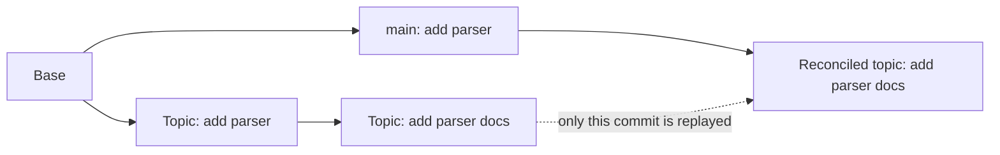
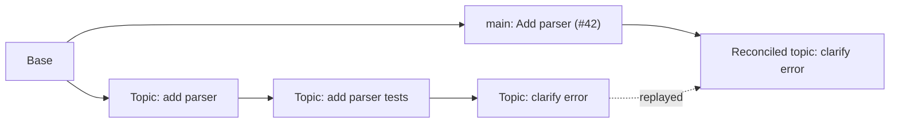
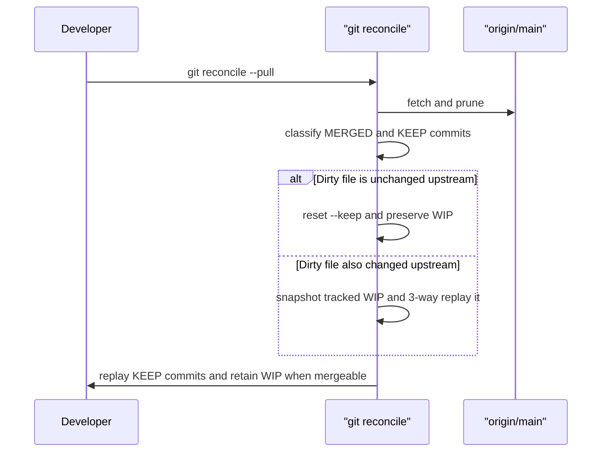

# git-reconcile

Reconcile a local Git branch with its upstream after pull requests have landed
there, including pull requests merged with GitHub's squash workflow.

`git reconcile` classifies each local commit as either:

- **MERGED** — represented upstream by patch equivalence, a GitHub squash
  commit subject, or a subject listed in a GitHub squash commit body.
- **KEEP** — not represented upstream and therefore replayed on top of the
  current upstream tip.

The dry run is the default. Applying the plan uses `git reset --keep` followed
by `git cherry-pick` rather than a stash/rebase/pop sequence.

## Requirements

- Git
- Bash 4 or newer

macOS ships Bash 3.2. Install a current Bash with Homebrew before using the
tool:

```sh
brew install bash
```

## Install

### From a clone

```sh
git clone https://github.com/<owner>/git-reconcile.git
cd git-reconcile
./install.sh
```

The installer places `git-reconcile` in `$HOME/.local/bin` by default. Add
that directory to `PATH` if needed:

```sh
export PATH="$HOME/.local/bin:$PATH"
```

Git discovers executables named `git-<command>` on `PATH`, so no Git alias
is required.

Use `git reconcile -h` for help. Git reserves `git <command> --help` for
manual-page lookup; `git-reconcile --help` also works when invoking the
executable directly.

### Homebrew

```sh
brew install matthewevans/tap/git-reconcile
```

## Usage

```sh
# Inspect the reconciliation plan. Makes no changes.
git reconcile [<upstream>]

# Reset to upstream and replay only commits that still need to be applied.
git reconcile --apply [<upstream>]

# Fetch and prune the remote that owns upstream, then apply the plan.
git reconcile --pull [<upstream>]

# Abort a survivor cherry-pick that paused on a conflict.
git reconcile --abort
```

The default upstream is the current branch's configured upstream. If none is
configured, it is `origin/main`.

## Examples

### 1. Drop a patch that upstream already has

Suppose a teammate cherry-picks your first commit onto `main`, while your
branch still has that commit plus a new documentation change:



Run the dry run first:

```sh
git reconcile origin/main
```

```text
MERGED (patch-id) 9e1a4c2b10  add parser
KEEP              7b3d9f6a42  add parser docs

git reset --keep origin/main && git cherry-pick 7b3d9f6a42...
```

The matching patch is dropped; the documentation commit is replayed on the
current `origin/main`:

```sh
git reconcile --apply origin/main
```

### 2. Continue a branch after a GitHub squash merge

A GitHub squash merge replaces several branch commits with one upstream commit.
The squash commit's subject and body retain enough provenance for
`git reconcile` to recognize the already-merged work:



If the upstream squash commit is:

```text
Add parser (#42)

* add parser
* add parser tests
```

then the dry run on the still-open topic branch reports:

```text
MERGED (squash)   1a2b3c4d5e  add parser
MERGED (squash)   6f7a8b9c0d  add parser tests
KEEP              abcdef1234  clarify error
```

Only `clarify error` is replayed. This is useful when you keep working on a
branch after its earlier pull request has been squash-merged.

### 3. Fetch, reconcile, and keep work in progress

`--pull` fetches the configured upstream remote, then applies the same plan
as `--apply`. It does not use `git stash`.



For example, while on `feature/login`:

```sh
# You have an unstaged edit in README.md and new commits are on origin/main.
git reconcile --pull
```

If the edit is unrelated to upstream changes, it remains in the working tree.
If both sides changed the same file, the command uses a 3-way replay: disjoint
hunks carry forward automatically, while actual overlapping lines are left for
you to resolve.

### 4. Resolve or abort a survivor conflict

Some `KEEP` commits can genuinely conflict with upstream. In that case,
`git reconcile --apply` pauses at the normal cherry-pick conflict:

```sh
git reconcile --apply origin/main

# Resolve conflict markers, then continue the remaining survivor commits.
git add path/to/resolved-file
git cherry-pick --continue
```

To discard the partial reconciliation and return to the original branch tip:

```sh
git reconcile --abort
```

## Safety model

- A dry run prints the exact `git reset --keep … && git cherry-pick …` command
  it would use.
- `--apply` refuses to start during a merge, rebase, revert, cherry-pick, or
  unresolved index conflict.
- Local merge commits are rejected because they cannot be replayed safely by
  `git cherry-pick`.
- An untracked path that upstream would create is rejected rather than
  overwritten.
- Uncommitted tracked work is carried forward when possible. If a dirty file
  also changed upstream, the tool snapshots the tracked work, reconciles the
  branch, and replays it with a 3-way merge.
- If a survivor commit conflicts, resolve it and run
  `git cherry-pick --continue`, or restore the prior tip with
  `git reconcile --abort`.

GitHub squash provenance intentionally uses exact, case-sensitive commit
subjects. This reduces false positives, but generic duplicate subjects can
still be ambiguous. Always review the dry-run table before applying it.

## Development

```sh
make lint
make test
```

The integration suite covers patch-id detection, GitHub squash provenance,
applying a reconciliation with tracked work in progress, conflict abort, and
fetch-before-apply behavior.

## License

MIT. See [LICENSE](LICENSE).
